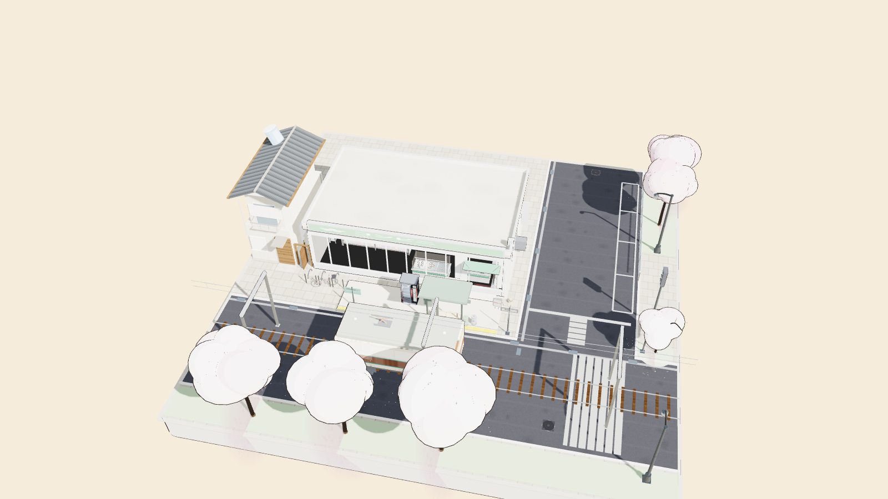

# Station Corner

**線上遊玩：https://pondahai.github.io/station-corner/**

這是一項 **Qwen3.8-27b 的測試**：一個可直接在瀏覽器開啟的街角便利店 3D 場景，並加入第一人行走、跳躍、碰撞與自動門進入功能。

原始提示來源：https://youtu.be/ggwOHpwpDoU?si=GPZnRKFSd-1xsZOW

## 開發大綱

這項測試從建立街角便利店 3D 場景開始，加入第一人行走、跳躍與碰撞；後來根據實際遊玩回饋修正自動門入口、櫃台動線與玻璃開口，最終整理並發布到 GitHub Pages。欲知詳細前因後果，請玩家看 [NOTES.md](NOTES.md)。

## 使用方式

直接開啟 `index.html` 即可，不需要安裝或建置。

## 操作方式

| 按鍵 | 功能 |
| --- | --- |
| `F` | 進入／退出第一人行走模式 |
| 滑鼠 | 轉動視角 |
| `W / A / S / D` | 前後左右移動 |
| `Shift` | 加速 |
| 空白鍵 | 跳躍 |
| `Esc` 或 `F` | 回到展示視角 |

## 測試重點

這個專案用來測試 Qwen3.8-27b 是否能協助完成以下工作：

- 在單一網頁 3D 場景中加入第一人称遊玩
- 處理移動、跳躍、重力與落地
- 處理商店、建築與場景邊界碰撞
- 修正自動門無法進入的問題
- 整理並發布到 GitHub Pages

## 技術說明

- 使用 Three.js 建立 3D 場景
- 不需要建置工具
- 可直接以靜態網頁方式部署在 GitHub Pages